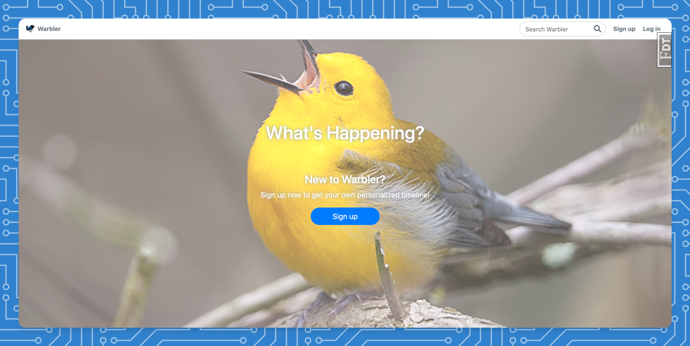

## Twitter clone - WARBLER

To get this application running, make sure you do the following in the Terminal:

1. `python3 -m venv venv`
2. `source venv/bin/activate`
3. `pip install -r requirements.txt`
4. `createdb warbler`
5. `python seed.py`
5. `flask run`

## FEATURES 

* authentication & authorisation
* posting messages on wall
* liking posts by other users
* following other users/being followed
* customisable profile

## SCREENSHOTS

## Technologies used

#### :snake: Python Backend

1. Flask
2. Flask-Bcrypt
3. Flask-SQLAlchemy
4. WTForms
